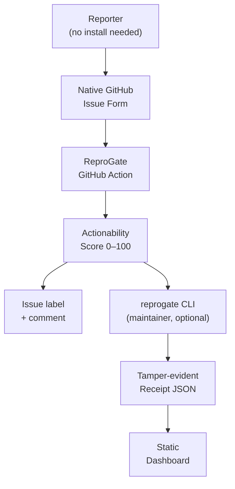

# ReproGate

[](https://github.com/gietsmaximiliano-pixel/reprogate/actions/workflows/ci.yml)
[](LICENSE)
[](https://github.com/gietsmaximiliano-pixel/reprogate/releases/tag/v0.1.0)

**Turn any GitHub issue into a structured, verifiable report.**
Reporters fill a native GitHub form — no install, no account beyond GitHub.
One workflow file gives maintainers automatic scoring, labeling, and tamper-evident receipts.

---

## Two-minute demo

|                          | Complete report                                                                        | Incomplete report                                                                      |
| ------------------------ | -------------------------------------------------------------------------------------- | -------------------------------------------------------------------------------------- |
| **Issue**                | [#1 — hash mismatch bug](https://github.com/gietsmaximiliano-pixel/reprogate/issues/1) | [#2 — "it doesn't work"](https://github.com/gietsmaximiliano-pixel/reprogate/issues/2) |
| **Score**                | 93 / 100                                                                               | 54 / 100                                                                               |
| **Label**                | `reprogate:complete`                                                                   | `reprogate:needs-info`                                                                 |
| **What the Action does** | Validates evidence, comments with scorecard, applies label                             | Lists missing fields, asks reporter to fill them in                                    |

Both issues above were validated automatically by the ReproGate Action in this repository.
No tool was installed by either reporter — they filled in a form on GitHub.

### What a complete report looks like

```yaml
# Reporter pastes this into the GitHub issue form — nothing to install
schemaVersion: "0.1"
reportType: bug
projectName: my-library
affectedVersion: 2.4.1
environment:
  os: Ubuntu 24.04
  runtime: Node.js 20.20.2
  dependencies:
    my-library: 2.4.1
summary: "parseConfig throws TypeError on an empty object instead of returning defaults"
expectedBehavior: parseConfig({}) should return the default configuration.
actualBehavior: parseConfig({}) throws TypeError — Cannot read properties of undefined.
stepsToReproduce:
  - npm install my-library@2.4.1
  - node -e "require('my-library').parseConfig({})"
  - Observe the TypeError
commands:
  - node -e "require('my-library').parseConfig({})"
redactionNotes: No secrets included.
aiAssisted: false
humanReviewed: true
createdAt: "2026-06-01T00:00:00.000Z"
```

**Action comment the maintainer sees:**

```
ReproGate validation: valid
Actionability score: 93/100

Evidence files: none

Score breakdown:
+5  Supported schema version
+4  Report type is bug
+6  Project name and version
+6  OS described
+5  Runtime included
+6  Dependency versions listed
+10 Summary is specific
+8  Expected behavior stated
+8  Actual behavior stated
+16 Reproduction steps are detailed
+8  Commands supplied
+4  Redaction notes provided
+7  Reporter manually reviewed

Label applied: reprogate:complete
```

### What an incomplete report triggers

```
ReproGate evidence check: valid
Actionability score: 54/100
Suggested label: reprogate:needs-info

Missing information: None.
Invalid fields: None.
```

All required fields were present but too vague to score above the threshold (default: 70/100).
The label `reprogate:needs-info` prompts the reporter to improve their report.

---

## Quick setup — add two files, done

### Step 1: Issue form

Create `.github/ISSUE_TEMPLATE/bug-report.yml` in your repository.
Copy the ready-to-use template from [`setup/reprogate-bug-report.yml`](setup/reprogate-bug-report.yml)
or download it:

```bash
mkdir -p .github/ISSUE_TEMPLATE
curl -fsSL \
  https://raw.githubusercontent.com/gietsmaximiliano-pixel/reprogate/main/setup/reprogate-bug-report.yml \
  -o .github/ISSUE_TEMPLATE/bug-report.yml
```

### Step 2: Validation workflow

Create `.github/workflows/reprogate.yml`:

```yaml
name: ReproGate

on:
  issues:
    types: [opened, edited]

permissions:
  contents: read
  issues: write

jobs:
  validate-issue:
    runs-on: ubuntu-latest
    steps:
      - name: Validate ReproGate evidence
        uses: gietsmaximiliano-pixel/reprogate/packages/github-action@v0.1.0
        with:
          github-token: ${{ github.token }}
```

Or download it:

```bash
mkdir -p .github/workflows
curl -fsSL \
  https://raw.githubusercontent.com/gietsmaximiliano-pixel/reprogate/main/setup/reprogate-workflow.yml \
  -o .github/workflows/reprogate.yml
```

Commit both files to your default branch. The Action runs automatically on every new or edited issue that contains a fenced ` ```reprogate ` block.

### Optional: scaffold everything with the CLI

```bash
npx reprogate@latest init
```

The CLI writes both files, the security report form, a configuration file, and a maintainer guide.
Run `reprogate --help` for the full command list.

---

## How it works



1. **Reporter** opens a GitHub issue and fills in the native form — no account beyond GitHub, no tool to install.
2. **The form** pre-fills a structured YAML block that the reporter edits in place.
3. **The Action** runs on every new or edited issue, parses the YAML, validates all fields, and posts one comment with the actionability score and missing-field list.
4. **Labels** route the issue: `reprogate:complete` for reports above the score threshold, `reprogate:needs-info` for those below it.
5. **Maintainers** can optionally use the CLI to generate receipts and dashboards for their own audit trail.

---

## Comparison

| Capability                             | GitHub Issue Forms | IssueOps Validator |  **ReproGate**   |
| -------------------------------------- | :----------------: | :----------------: | :--------------: |
| Native form UI for reporters           |         ✅         |         ✅         |        ✅        |
| No install required for reporters      |         ✅         |         ✅         |        ✅        |
| Required-field enforcement at submit   |     ✅ UI only     |         ✅         |        ✅        |
| Validation re-runs on issue edits      |         ❌         |         ✅         |        ✅        |
| Structured data preserved after submit | ❌ plain Markdown  |    ❌ re-parsed    |     ✅ YAML      |
| Actionability score (0–100)            |         ❌         |         ❌         |        ✅        |
| Evidence file SHA-256 verification     |         ❌         |         ❌         |        ✅        |
| Tamper-evident receipt artifact        |         ❌         |         ❌         |        ✅        |
| Security-report form + guidance        |         ❌         |         ❌         |        ✅        |
| Automated reporter support (CI bots)   |         ❌         |         ❌         |        ✅        |
| Custom domain validation rules         |         ❌         |    ✅ custom JS    | ✅ schema-driven |
| Self-contained — no AI, no SaaS        |         ✅         |         ✅         |        ✅        |

**GitHub Issue Forms** provides a guided UI and enforces required fields at submission time, but the structure is flattened to plain Markdown immediately after. There is no post-submission validation, no scoring, and no audit trail.

**IssueOps Validator** closes the post-submission gap by running on issue events and re-parsing the Markdown body. It supports custom JavaScript validators for domain-specific rules but requires those scripts to be written and deployed per project. It has no scoring, no evidence hashing, and no security-report workflow.

**ReproGate** adds an evidence-quality layer on top of GitHub Issue Forms: structured YAML that survives edits, a 0–100 actionability score, evidence file hashing, tamper-evident receipts, and first-class support for security and automated reports.

---

## Security reports

ReproGate ships a second issue form for security disclosures.
`reprogate init` writes `.github/ISSUE_TEMPLATE/security-report.yml`.

The security form:

- Sets `reportType: security` in the YAML block.
- Requires reporters to confirm no credentials, tokens, or exploit payloads are included.
- Adds a prominent notice pointing to [GitHub Security Advisories](https://docs.github.com/en/code-security/security-advisories) for high-severity issues that should stay private.
- Validates the same evidence fields as the bug form.

For **high-severity vulnerabilities** that must not be public, instruct reporters to use the Security Advisories tab ("Report a vulnerability") rather than the public issue form. Configure this in your repository's `SECURITY.md`.

---

## Automated reports

ReproGate is designed for CI-generated bug reports, not just human reporters.

A CI system that detects a regression can generate and submit a manifest programmatically:

````bash
# Generate manifest from CI context
cat > reprogate.yml << EOF
schemaVersion: "0.1"
reportType: regression
projectName: my-library
affectedVersion: $(git describe --tags)
environment:
  os: ubuntu-24.04
  runtime: node-$(node --version)
  dependencies:
    my-library: $(node -p "require('./package.json').version")
summary: "Test suite regression detected in CI on commit $(git rev-parse --short HEAD)"
expectedBehavior: All tests pass on the main branch.
actualBehavior: $(cat test-failure-summary.txt)
stepsToReproduce:
  - git checkout $(git rev-parse HEAD)
  - npm test
commands:
  - npm test
aiAssisted: false
humanReviewed: false
createdAt: "$(date -u +%Y-%m-%dT%H:%M:%SZ)"
EOF

# Submit as a GitHub issue
gh issue create \
  --title "CI regression: $(git describe --tags)" \
  --body "$(cat reprogate.yml | awk '{print "```reprogate\n" $0 "\n```"}')"
````

The Action then scores the automated report just like a human one.
`humanReviewed: false` is valid — the score reflects the evidence quality, not whether a human wrote it.

---

## CLI reference (advanced, optional)

Maintainers who want local workflows can install the CLI separately. The CLI is not required for the core reporter → Action → label flow.

| Command                            | Description                                           |
| ---------------------------------- | ----------------------------------------------------- |
| `reprogate init`                   | Scaffold issue templates, workflow, config, and guide |
| `reprogate create`                 | Interactively build a manifest                        |
| `reprogate validate <path>`        | Validate a manifest and print the score               |
| `reprogate receipt <path>`         | Generate a tamper-evident receipt JSON                |
| `reprogate render <path>`          | Render a Markdown issue summary                       |
| `reprogate dashboard <dir>`        | Generate a static receipt dashboard                   |
| `reprogate verify-safe-run <path>` | Opt-in Docker verification (manual review required)   |

---

## Architecture

| Package                  | Role                                                                                               |
| ------------------------ | -------------------------------------------------------------------------------------------------- |
| `packages/spec`          | Evidence Manifest types, Zod schema, normalization, hashing, scoring, receipts, Markdown rendering |
| `packages/cli`           | `reprogate` command-line interface                                                                 |
| `packages/github-action` | Issue-body parser, validator, label selection, marker-comment logic                                |
| `packages/dashboard`     | Static receipt dashboard generator                                                                 |
| `packages/ai-adapters`   | Optional mock AI interface (advisory only, not in the validation path)                             |

---

## Security model

- Public issue automation parses untrusted text as **data only** — no execution.
- The core validation path is **deterministic** and requires no AI or external APIs.
- Evidence paths are restricted to safe relative paths.
- Receipts hash normalized manifests and local evidence files using SHA-256.
- The workflow uses minimal permissions: `contents: read`, `issues: write`.
- `pull_request_target` is never used.
- Safe-run is **Docker-only, opt-in, network-disabled, resource-limited**, and requires explicit confirmation.

See [docs/THREAT_MODEL.md](docs/THREAT_MODEL.md) for details.

---

## Contributing

Read [CONTRIBUTING.md](CONTRIBUTING.md), [SECURITY.md](SECURITY.md), and [AGENTS.md](AGENTS.md).

## License

Apache-2.0. See [LICENSE](LICENSE).
