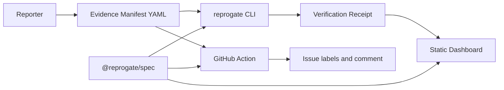

# ReproGate

[](.github/workflows/ci.yml)
[](LICENSE)
[](CHANGELOG.md)

ReproGate is an evidence-first intake toolkit that helps open-source maintainers turn incomplete reports into structured, reproducible evidence.

Maintainers lose time on reports that are vague, unverifiable, or missing the environment details needed to reproduce them. ReproGate provides a portable Evidence Manifest, CLI, GitHub Action, receipts, and a static dashboard so projects can ask for better evidence without adding telemetry, paid services, or AI dependencies.

ReproGate is not an AI spam detector. It does not guess whether a report was written by AI, because AI-origin detection is unreliable and not useful enough for maintainer triage. Instead, it checks whether the report contains enough structured evidence to be actionable.

## Architecture



## 5-minute quickstart

```sh
corepack enable
corepack pnpm install
corepack pnpm build
corepack pnpm --filter reprogate exec reprogate init
corepack pnpm --filter reprogate exec reprogate validate examples/basic-node-bug/reprogate.yml
corepack pnpm --filter reprogate exec reprogate render examples/basic-node-bug/reprogate.yml
```

## CLI examples

```sh
reprogate init
reprogate create
reprogate validate reprogate.yml
reprogate receipt reprogate.yml --output receipts/report.receipt.json
reprogate render reprogate.yml --output issue.md
reprogate dashboard ./receipts --output ./site
```

Trusted maintainers can opt into local Docker verification after manual review:

```sh
reprogate verify-safe-run reprogate.yml
```

This command shows the exact Docker commands before execution, disables network access, uses a non-root user, applies CPU and memory limits, and fails safely if Docker is unavailable.

## GitHub Action setup

`reprogate init` writes a starter issue workflow and issue template. The action validates fenced `reprogate` YAML blocks in issue bodies, adds one ReproGate label, and posts or updates one concise comment.

The default issue workflow never executes commands from public issues, does not use `pull_request_target`, does not expose secrets, and does not call external APIs beyond the GitHub API needed for labels and comments.

## Screenshot placeholder

After generating a dashboard with `reprogate dashboard ./receipts --output ./site`, open `site/index.html` in a browser and capture a screenshot for project documentation. Do not use mock adoption metrics or invented user claims.

## Security model

- Public issue automation parses untrusted text as data only.
- The core validation path is deterministic and does not require AI or external APIs.
- Evidence paths must be safe relative paths.
- Receipts hash normalized manifests and local evidence files.
- Safe-run is Docker-only, opt-in, network-disabled, resource-limited, and requires explicit confirmation unless `--yes` is supplied.

See [docs/THREAT_MODEL.md](docs/THREAT_MODEL.md) for details.

## Why evidence-first intake matters

Good reports make maintainers faster and kinder. They reduce back-and-forth, preserve context, and give contributors a clear way to show what happened without needing to know each project's private triage habits.

## Pilot adoption

ReproGate is designed for small pilots. Start with the issue template and validation action, watch which fields reporters miss, then tune maintainer guidance before making it a required intake step.

Maintainers who want help testing ReproGate in their repository are encouraged to open an issue with their project context and intake goals.

## Roadmap

See [ROADMAP.md](ROADMAP.md). Roadmap items are not implemented features.

## Contributing

Read [CONTRIBUTING.md](CONTRIBUTING.md), [SECURITY.md](SECURITY.md), and [AGENTS.md](AGENTS.md). Keep changes local-first, deterministic, and safe for public issue automation.

## License

Apache-2.0. See [LICENSE](LICENSE).
